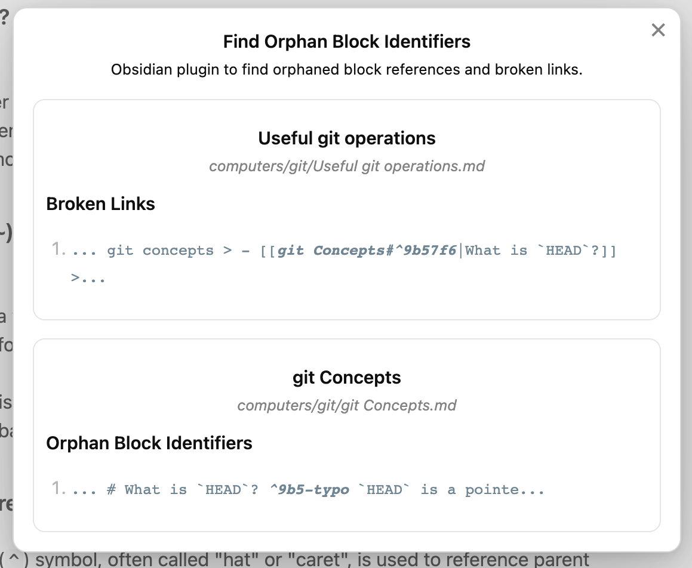

# obsidian-find-orphan-block-identifiers

> Obsidian plugin to find orphaned block references and broken links.

<p align="center">

</p>

## Gist

As notes are updated over time, block identifiers may be no longer linked and are orphaned. In addition, there may be broken links that do not point to a block identifier that no longer exists.

This plugin identifies and locates both orphaned block identifiers and broken links in your notes.

## Usage

Click on ribbon icon with title "Find Orphan Block Identifiers".

Or, you can invoke the command `Find Orphan Block Identifiers: Scan Vault` via the command palette (open it with `cmd + p` or `ctrl + p`).

## In-depth information

A block is a unit of text in your note, for example a paragraph, block quote, or even a list item.

A block identifier (or reference) is a caret (`^`) followed by one or more alphanumeric characters.

Block identifiers can only consist of letters, numbers, and dashes.

For example:

```
"You do not rise to the level of your goals. You fall to the level of your systems." by James Clear ^quote-of-the-day

"The quick brown fox jumps over the lazy dog" ^37066d
```

You typically link to a block by adding `#^` at the end of your link destination followed by a unique block identifier, for example, `[[2023-01-01#^37066d]]`.

However, as notes are updated over time, these identifiers may be no longer linked and are orphaned. In addition, there may be broken links that do not point to an identifier that no longer exists.

This plugin identifies and locates both orphaned block identifiers and broken links in your notes.

This is taken verbatim from: https://help.obsidian.md/Linking+notes+and+files/Internal+links#Link+to+a+block+in+a+note

# License

MIT.
